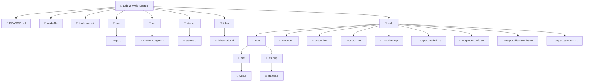

# Lab 2 - Bare-Metal LED Blink with C Startup (STM32F103)

A bare-metal embedded C project targeting the **STM32F103** (ARM Cortex-M3) microcontroller. This lab demonstrates building a complete firmware image from scratch using a C-based startup file, a GNU LD linker script, and a modular Makefile build system — with no HAL, no CMSIS, and no vendor libraries.

The firmware blinks the onboard LED (PA13) using direct register manipulation, proving full control over the microcontroller from power-on reset through the interrupt vector table, `.data` relocation, `.bss` zeroing, and the main application loop.

---

## Features

- **Bare-metal register access** — no HAL, no CMSIS, no SDK dependencies
- **C-based startup file** — vector table, `.data` copy, `.bss` zero, branch to `main`
- **GNU LD linker script** — full control over FLASH/SRAM memory layout and section placement
- **Toolchain abstraction layer** — `toolchain.mk` isolates all compiler/linker/tool paths and flags
- **Modular Makefile** — separate compilation, linking, and post-processing stages
- **Multiple output formats** — `.elf`, `.bin`, `.hex`
- **Diagnostic reports** — symbol table, disassembly, readelf, ELF info, map file
- **Bit-field register access** — demonstrates union/struct-based ODR manipulation
- **Platform types header** — portable volatile and fixed-width type aliases

---

## Architecture

```
┌─────────────────────────────────────────────────────┐
│                    Application Layer                 │
│                     src/App.c                        │
│          GPIO init + LED toggle main loop            │
└──────────────────────┬──────────────────────────────┘
                       │
┌──────────────────────▼──────────────────────────────┐
│                   Startup Layer                      │
│                  startup/startup.c                   │
│    Vector table (.vectors) ─► Reset_Handler          │
│    .data copy ─► .bss zero ─► main()                │
└──────────────────────┬──────────────────────────────┘
                       │
┌──────────────────────▼──────────────────────────────┐
│              Linker Script Layer                     │
│             linker/linkerscript.ld                   │
│    MEMORY regions ─► SECTIONS layout                │
│    Symbol exports: _E_text, _S_data, _E_data, etc.  │
└──────────────────────┬──────────────────────────────┘
                       │
┌──────────────────────▼──────────────────────────────┐
│              Type Abstraction Layer                  │
│              inc/Platform_Types.h                    │
│    Fixed-width types, volatile types, booleans      │
└─────────────────────────────────────────────────────┘
```

**Design philosophy:** Each layer has a single responsibility. The startup code never touches application logic. The linker script never assumes section content. The build system abstracts the toolchain entirely.

---

## 📁 Project Structure



---

## Build System

### Makefiles

| File | Role |
|------|------|
| `makefile` | Top-level build orchestration. Defines directory variables, source file discovery, build rules for compilation, linking, and post-processing (bin, hex, readelf, disassembly, symbols). Includes `toolchain.mk`. |
| `toolchain.mk` | Toolchain abstraction. Defines tool paths (`CC`, `AS`, `LD`, `CP`, `OD`, `RE`, `NM`) and all compiler/assembler/linker flags. Overridable via environment variables or command-line. |

### Toolchain

The default toolchain is the **ARM GCC bare-metal cross-compiler** (`arm-none-eabi-gcc`), configured in `toolchain.mk`:

```makefile
TOOLCHAIN ?= C:/TOOLCHAINS/ARM_TOOLCHAIN/bin/arm-none-eabi-
```

**Overriding the toolchain** (e.g., for Linux or a different installation path):

```bash
# Linux example
make TOOLCHAIN=/usr/bin/arm-none-eabi-

# Custom path
make TOOLCHAIN=/opt/gcc-arm/bin/arm-none-eabi-
```

### Build Flow

```
┌──────────────┐     ┌──────────────┐
│  App.c       │     │  startup.c   │
│  (src/)      │     │  (startup/)  │
└──────┬───────┘     └──────┬───────┘
       │ gcc -c              │ gcc -c
       ▼                     ▼
┌──────────────┐     ┌──────────────┐
│  App.o       │     │  startup.o   │
└──────┬───────┘     └──────┬───────┘
       │                     │
       └─────────┬───────────┘
                 │ ld -T linkerscript.ld
                 ▼
          ┌──────────────┐
          │  output.elf  │
          └──────┬───────┘
                 │
       ┌─────────┼──────────┬───────────────┬─────────────────┐
       │         │          │               │                 │
       ▼         ▼          ▼               ▼                 ▼
   output.bin output.hex readelf.txt disassembly.txt symbols.txt
```

### Output Folders

| Directory | Contents |
|-----------|----------|
| `build/` | All build artifacts (cleaned by `make clean`) |
| `build/objs/` | Compiled `.o` files, preserving source directory structure |

---

## Supported Toolchains

This project is designed for any `arm-none-eabi-` prefixed GCC toolchain. Detected/supported toolchains:

| Toolchain | Platform | Notes |
|-----------|----------|-------|
| `arm-none-eabi-gcc` (ARM GNU Toolchain) | Windows, Linux, macOS | Default. Install via [Arm Developer](https://developer.arm.com/downloads/-/gnu-rm). |
| `C:/TOOLCHAINS/ARM_TOOLCHAIN/bin/arm-none-eabi-` | Windows | Hardcoded default path; override with `TOOLCHAIN=`. |

The build system uses `gcc` for compilation, `as` for assembly, `ld` for linking, `objcopy` for binary/hex generation, `objdump` for disassembly, `readelf` for ELF inspection, and `nm` for symbol listing.

---

## Build Examples

```bash
# Build with default toolchain
make

# Build with custom toolchain path
make TOOLCHAIN=/usr/local/gcc-arm/bin/arm-none-eabi-

# Clean all build artifacts
make clean

# Build with verbose output (uncomment debug lines in makefile)
make 2>&1 | tee build.log

# Inspect memory layout
cat build/mapfile.map

# Inspect symbols
cat build/output_symbols.txt

# Inspect disassembly
cat build/output_disassembly.txt
```

---

## Generated Files

| File | Format | Purpose |
|------|--------|---------|
| `output.elf` | ELF32 (little-endian ARM) | Executable with debug symbols, sections, and headers. Used for debugging. |
| `output.bin` | Raw binary | Flat binary image for flashing at address `0x08000000`. Produced by `objcopy -O binary`. |
| `output.hex` | Intel HEX | ASCII hex representation for flash programmers (ST-Link, OpenOCD, etc.). Produced by `objcopy -O ihex`. |
| `mapfile.map` | Text | Linker memory map showing section placement, sizes, and symbol addresses. |
| `output_readelf.txt` | Text | Full `readelf -a` output: ELF headers, sections, program headers, symbol table, attributes. |
| `output_elf_info.txt` | Text | `objdump -x` output: program headers, section details, symbol table. |
| `output_disassembly.txt` | Text | `objdump -D` full disassembly of all sections (useful for verifying generated code). |
| `output_symbols.txt` | Text | `nm` symbol table listing all symbols with addresses, types, and names. |

---

## Project Workflow

1. **Write application code** in `src/App.c` — configure registers, implement logic.
2. **Write startup code** in `startup/startup.c` — vector table, `.data` copy, `.bss` zeroing, branch to `main`.
3. **Write linker script** in `linker/linkerscript.ld` — define memory regions and section layout.
4. **Configure types** in `inc/Platform_Types.h` — volatile aliases, fixed-width types.
5. **Run `make`** — compiles all `.c` files, links with the linker script, produces `.elf`, `.bin`, `.hex`, and diagnostic reports.
6. **Flash the binary** — use ST-Link, OpenOCD, or any STM32 programmer to write `output.bin` or `output.hex` to address `0x08000000`.
7. **Verify** — observe LED blinking on PA13, or use `output_disassembly.txt` / `mapfile.map` for static analysis.

---

## Folder Description

| Folder | Description |
|--------|-------------|
| `src/` | Application source files. Contains `main()` and all application-level logic. Only `App.c` exists currently. |
| `inc/` | Header files. Contains platform-specific type definitions shared across all source files. |
| `startup/` | Startup code. Contains the C-based vector table and `Reset_Handler` that initializes the microcontroller before calling `main()`. |
| `linker/` | Linker scripts. Contains GNU LD scripts that define the memory map (FLASH, SRAM) and section placement. |
| `build/` | Build output. All generated artifacts (`.o`, `.elf`, `.bin`, `.hex`, reports) are placed here. Cleaned by `make clean`. |
| `build/objs/` | Object files. Mirrors the source directory structure (`src/`, `startup/`). |

---

## Important Source Files

### `src/App.c`

The main application file. Responsibilities:

- **Register definitions** — defines `RCC_BASE`, `GPIOA_BASE`, `RCC_APB2ENR`, and `GPIOA_CHR` as memory-mapped register addresses using pointer dereference macros.
- **Bit-field union** — `R_ODR_t` union with a `pin` struct allowing individual bit access (specifically `P13`) alongside full 32-bit access.
- **Global variables** — `g_vars[3]` (mutable, goes to `.data`) and `g_const_vars[3]` (const, goes to `.rodata`).
- **`main()` function** — enables GPIOA clock via RCC, configures PA13 as push-pull output (2 MHz), then toggles PA13 in an infinite loop with a busy-wait delay.

### `startup/startup.c`

The C-based startup file. Responsibilities:

- **Stack pointer initialization** — references `_stack_top` symbol from the linker script.
- **Interrupt vector table** — placed in `.vectors` section (mapped to address `0x08000000` via the linker script). Contains: initial SP, Reset_Handler, NMI, HardFault, MemoryManagement, BusFault, UsageFault, SVC, PendSV, SysTick, and a generic external interrupts handler. All fault/exception handlers are `weak` aliases to `Reset_Handler`.
- **`Reset_Handler()`** — copies `.data` from FLASH to SRAM, zeros `.bss` in SRAM, then calls `main()`.

### `inc/Platform_Types.h`

Platform abstraction header. Provides:

- Boolean type (`_Bool` → `boolean`) with `TRUE`/`FALSE` macros
- Signed and unsigned fixed-width types (`sint8`–`sint64`, `uint8`–`uint64`)
- `volatile` qualified variants (`vuint8`–`vuint64`, `vint8`–`vint64`, `vfloat32`, `vdouble64`)
- Floating-point aliases (`float32`, `double64`)

### `linker/linkerscript.ld`

GNU LD linker script. Defines:

- **MEMORY regions** — `flash` at `0x08000000` (128 KB), `sram` at `0x20000000` (20 KB)
- **SECTIONS** — `.text` (vectors + code + rodata → flash), `.data` (initialized data → SRAM, load address in flash), `.bss` (zero-initialized data → SRAM)
- **Symbols** — `_E_text`, `_S_data`, `_E_data`, `_S_bss`, `_E_bss`, `_stack_top`

### `toolchain.mk`

Toolchain configuration file. Defines:

- Tool paths: `CC`, `AS`, `LD`, `CP`, `OD`, `RE`, `NM`
- Compiler flags: `-c -Wall -Wextra -Werror -mcpu=cortex-m3 -g -gdwarf-3 -O0`
- Assembler flags: `-mcpu=cortex-m3 -g -gdwarf-2`
- Linker flags: `-T linkerscript.ld -Map=mapfile.map`
- Binary output flags: `-O binary`, `-O ihex`
- Readelf flags: `-a`

### `makefile`

Top-level build Makefile. Responsibilities:

- Discovers source files via `wildcard` in `src/` and `startup/`
- Computes object file paths preserving directory structure
- Includes `toolchain.mk`
- Builds: compilation → linking → bin/hex/readelf/disassembly/symbols generation
- `clean` target removes entire `build/` directory

---

## Design Decisions

1. **C-based startup over assembly** — The startup file is written entirely in C rather than inline assembly or a separate `.s` file. This makes the startup code more readable and maintainable while still providing full control over the vector table and initialization sequence.

2. **Weak aliases for exception handlers** — All fault/exception handlers (`NMI_Handler`, `HardFault_Handler`, etc.) are declared as weak aliases to `Reset_Handler`. This provides a default behavior (reset on any fault) while allowing the application to override any handler by defining a strong symbol.

3. **Toolchain abstraction via `toolchain.mk`** — All toolchain-specific paths and flags are isolated in `toolchain.mk`, making it trivial to switch compilers or platforms without modifying the main `makefile`.

4. **No HAL or CMSIS** — The project uses raw register addresses and pointer dereference macros. This is intentional for educational purposes: it forces understanding of the memory-mapped I/O model and the ARM Cortex-M3 memory map.

5. **Busy-wait delays** — The LED blink uses simple `for` loop delays rather than SysTick or timers. This keeps the focus on GPIO register manipulation and avoids timer interrupt complexity.

6. **Linker script memory regions match STM32F103** — The 128 KB flash and 20 KB SRAM sizes correspond to the STM32F103C8 (Blue Pill) or STM32F103RB variant.

7. **Diagnostic output generation** — The Makefile automatically generates symbol tables, disassembly, readelf reports, and ELF info. These are invaluable for debugging and verifying the build without needing an IDE.

---

## Customization

### Adding New Source Files

1. Place `.c` files in `src/` — they are auto-discovered by the Makefile via `wildcard`.
2. Place `.h` files in `inc/`.
3. Include headers in your source: `#include "YourHeader.h"`.
4. Run `make` — no Makefile changes needed.

### Adding New Modules

For multi-file modules (e.g., a UART driver):

1. Create a subdirectory: `src/drivers/`
2. Place source files there: `src/drivers/uart.c`, `src/drivers/uart.h`
3. Add the include path in `toolchain.mk`: `CFLAGS += -I inc/drivers`
4. The Makefile's `wildcard` will pick up all `.c` files in `src/` and its subdirectories.

> **Note:** The current Makefile uses `wildcard $(src_dir)*.c` which only matches files directly in `src/`, not subdirectories. To support subdirectories, change the wildcard to `$(wildcard $(src_dir)**/*.c)` or use `$(shell find $(SRC_DIR) -name '*.c')`.

### Adding New Toolchains

1. Create a new file (e.g., `toolchain_iar.mk` or `toolchain_armcc.mk`).
2. Define the tool paths and flags for the new toolchain.
3. Override the toolchain from the command line: `make -f makefile TOOLCHAIN_IAR=1`

### Adding New Linker Scripts

1. Place the new linker script in `linker/` (e.g., `linkerscript_custom.ld`).
2. Override the linker script via the command line or modify `LDFLAGS` in `toolchain.mk`.

### Adding New Startup Files

The startup directory supports both `.c` and `.s` files. To add a custom assembly startup:

1. Place the `.s` file in `startup/`.
2. The Makefile will compile it using the assembler (`AS`) with `ASFLAGS`.
3. Both C and Assembly startup files are supported simultaneously (the Makefile handles both extensions).

---

## Requirements

### Toolchain

- **ARM GCC Cross-Compiler** (`arm-none-eabi-gcc`): Required for compilation, assembly, and linking.
  - Download: [Arm GNU Toolchain](https://developer.arm.com/downloads/-/gnu-rm)
  - Or install via package manager: `sudo apt install gcc-arm-none-eabi` (Linux)

### Build Utilities

- **GNU Make** — build orchestration
- **GNU Binutils** — `objcopy`, `objdump`, `readelf`, `nm` (included with the toolchain)

### Hardware

- **STM32F103** development board (e.g., Blue Pill, Nucleo, or custom board)
- **ST-Link V2** or compatible SWD programmer for flashing
- LED connected to PA13 (most Blue Pill boards have an onboard LED on this pin)

### Optional

- **OpenOCD** — for command-line flashing: `openocd -f interface/stlink.cfg -f target/stm32f1x.cfg -c "program output.elf verify reset exit"`
- **STM32CubeProgrammer** — GUI-based flashing via `.hex` or `.bin` files

---

## 📁 Example Project Structure


---

## Code Quality Notes

### Bugs and Issues

1. **Startup `.data` copy uses wrong stride** — The `_data_size` calculation in `startup.c` subtracts `uint32 *` pointers, yielding a count of `uint32` elements. The copy loop then increments `dst` and `src` as `uint32 *`, which works but the pointer increment inside the dereference (`*((uint32 *)dst++)`) is redundant and potentially confusing. Consider using `uint32 *` throughout without casting inside the dereference.

2. **`main()` has unreachable `return 0`** — The `while(1)` loop is infinite, so the `return 0` after the loop can never execute. While not a bug (the compiler handles this), it is dead code.

3. **`main()` returns `int` but `Reset_Handler` does not check the return value** — `Reset_Handler` calls `main()` but discards the return. This is standard practice but worth noting.

4. **Weak handlers aliased to `Reset_Handler`** — All fault/exception handlers default to `Reset_Handler`, which performs initialization and calls `main()`. If a fault occurs after initialization, this will re-initialize `.data`/`.bss` and restart the application rather than entering a known fault state. A more robust approach would be an infinite loop (`while(1) {}`) for fault handlers.

5. **Vector table has incorrect reserved slots** — The Cortex-M3 vector table has specific reserved entries (positions 7–10: Reserved, Reserved, Reserved, Reserved). The current code places `Reserved` correctly at positions 7–10, but the `ExternalInterruptsHandler` at position 16 should only handle interrupts beyond the standard Cortex-M3 exceptions. For the STM32F103, the external interrupt vector table continues from index 16 onward (EXTI0, EXTI1, ..., DMA channels, etc.). Currently, only a single generic handler is provided, which means all external interrupts share the same handler.

### Bad Practices

- **Magic numbers** — Register addresses (`0x40021000`, `0x40010800`) and offsets (`0x18`, `0x04`, `0x0C`) are raw hex. Using named macros or an SVD-generated header would improve readability.
- **Bit manipulation clarity** — `GPIOA_CHR &= 0xff0fffff; GPIOA_CHR |= 0x00200000;` would benefit from named bit-field definitions for CNFy and MODEy fields.
- **Busy-wait delay** — The `for(uint16 i = 0; i < 10000; i++);` delay is compiler-dependent and will vary with optimization level. A `volatile` loop counter or a timer-based delay would be more reliable.

### Positive Observations

- Clean separation of concerns across files
- Proper use of `volatile` for hardware registers
- Toolchain abstraction is well-implemented
- Diagnostic output generation is thorough
- Bit-field union pattern for GPIO ODR is a common and practical embedded C idiom

---


## Memory Layout (STM32F103)

```
FLASH (128 KB)                    SRAM (20 KB)
┌─────────────────────┐           ┌─────────────────────┐
│ 0x08000000          │           │ 0x20000000          │
│  .vectors (68 B)    │           │  .data    (4 B)     │
│  .text    (112 B)   │           │  .bss     (0 B)     │
│  .rodata  (3 B)     │           │          ...        │
│          ...        │           │                     │
│                     │           │                     │
│                     │           │ 0x200003EC          │
│                     │           │  _stack_top         │
│                     │           │  (1000 B stack)     │
│ 0x0801FFFF          │           │ 0x20004FFF          │
└─────────────────────┘           └─────────────────────┘
```

| Symbol | Address | Description |
|--------|---------|-------------|
| `_stack_top` | `0x200003EC` | Top of stack (SRAM base + 20 KB − 1 KB) |
| `_S_data` | `0x20000000` | Start of `.data` section in SRAM |
| `_E_data` | `0x20000004` | End of `.data` section in SRAM |
| `_S_bss` | `0x20000004` | Start of `.bss` section in SRAM |
| `_E_bss` | `0x20000004` | End of `.bss` section in SRAM |
| `_E_text` | `0x08000150` | End of `.text` section (load address for `.data`) |
| `vectors` | `0x08000000` | Start of interrupt vector table |
| `main` | `0x080000D4` | Application entry point |
| `Reset_Handler` | `0x08000044` | Reset handler entry point |

---

## Startup Sequence

```
Power-On / Reset
       │
       ▼
CPU reads SP from vectors[0] (0x200003EC)
       │
       ▼
CPU reads PC from vectors[1] → Reset_Handler (0x08000044)
       │
       ▼
Reset_Handler:
  1. Copy .data from FLASH (_E_text) to SRAM (_S_data → _E_data)
  2. Zero .bss in SRAM (_S_bss → _E_bss)
  3. Call main()
       │
       ▼
main():
  1. Enable GPIOA clock (RCC_APB2ENR |= (1 << 2))
  2. Configure PA13 as push-pull output (GPIOA_CHR)
  3. Enter infinite loop: toggle PA13 with delay
```

