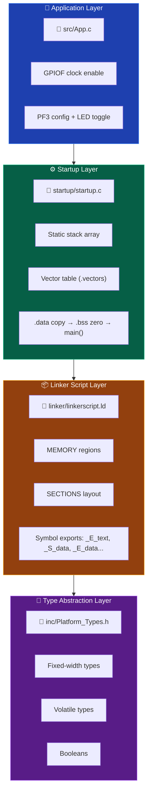
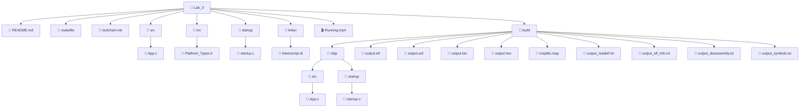
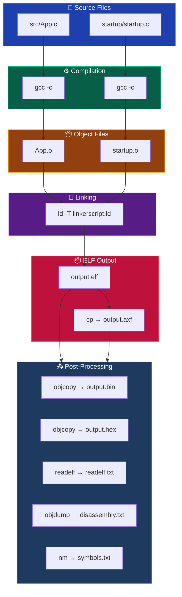
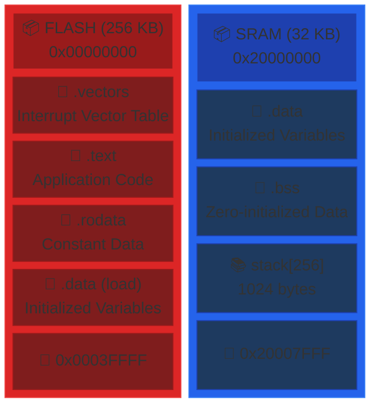
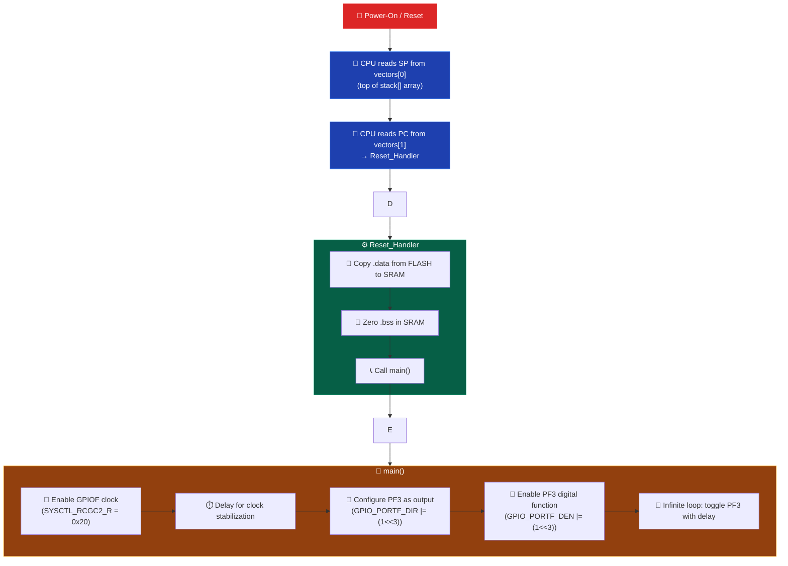

# Lab 3 - Bare-Metal LED Blink on TM4C123G (Tiva C Series)

A bare-metal embedded C project targeting the **TM4C123G** (ARM Cortex-M4) microcontroller from the TI Tiva C Series. This lab demonstrates building a complete firmware image from scratch using a C-based startup file, a GNU LD linker script, and a modular Makefile build system — with no HAL, no CMSIS, and no vendor libraries.

The firmware blinks the onboard RGB LED (PF3 — green) on the TM4C123G LaunchPad using direct register manipulation, proving full control over the microcontroller from power-on reset through the interrupt vector table, `.data` relocation, `.bss` zeroing, and the main application loop.

---

## 🎥 Demo

<p align="center">
  <video src="./Running.mp4" poster="./docs/images/demo-thumbnail.png" controls width="900"></video>
</p>

<p align="center">
<b>▶ Click the image above to watch the demonstration video.</b>
</p>

---

## Features

- **Bare-metal register access** — no HAL, no CMSIS, no SDK dependencies
- **C-based startup file** — vector table, `.data` copy, `.bss` zero, branch to `main`
- **Static stack allocation** — stack defined as a C array in the startup file, no linker-derived stack pointer
- **GNU LD linker script** — full control over FLASH/SRAM memory layout and section placement
- **Toolchain abstraction layer** — `toolchain.mk` isolates all compiler/linker/tool paths and flags
- **Modular Makefile** — separate compilation, linking, and post-processing stages
- **Multiple output formats** — `.elf`, `.axf`, `.bin`, `.hex`
- **Diagnostic reports** — symbol table, disassembly, readelf, ELF info, map file
- **TM4C123G GPIO Port F** — direct register manipulation for the onboard RGB LED

---

## Architecture



**Design philosophy:** Each layer has a single responsibility. The startup code handles initialization and the vector table. The linker script defines the memory map. The build system abstracts the toolchain entirely.

---

## 📁 Project Structure



---

## Build System

### Makefiles

| File | Role |
|------|------|
| `makefile` | Top-level build orchestration. Defines directory variables, source file discovery, build rules for compilation, linking, and post-processing (bin, hex, readelf, disassembly, symbols). Copies `.elf` to `.axf`. Includes `toolchain.mk`. |
| `toolchain.mk` | Toolchain abstraction. Defines tool paths (`CC`, `AS`, `LD`, `CP`, `OD`, `RE`, `NM`) and all compiler/assembler/linker flags. Overridable via environment variables or command-line. |

### Toolchain

The default toolchain is the **ARM GCC bare-metal cross-compiler** (`arm-none-eabi-gcc`), configured in `toolchain.mk`:

```makefile
TOOLCHAIN ?= C:/Tools/TOOLCHAIN/ARM_TOOLCHAIN/bin/arm-none-eabi-
```

**Overriding the toolchain** (e.g., for Linux or a different installation path):

```bash
# Linux example
make TOOLCHAIN=/usr/bin/arm-none-eabi-

# Custom path
make TOOLCHAIN=/opt/gcc-arm/bin/arm-none-eabi-
```

### Build Flow



### Output Folders

| Directory | Contents |
|-----------|----------|
| `build/` | All build artifacts (cleaned by `make clean`) |
| `build/objs/` | Compiled `.o` files, preserving source directory structure |

---

## Supported Toolchains

This project is designed for any `arm-none-eabi-` prefixed GCC toolchain. Detected/supported toolchains:

| Toolchain | Platform | Notes |
|-----------|----------|-------|
| `arm-none-eabi-gcc` (ARM GNU Toolchain) | Windows, Linux, macOS | Default. Install via [Arm Developer](https://developer.arm.com/downloads/-/gnu-rm). |
| `C:/Tools/TOOLCHAIN/ARM_TOOLCHAIN/bin/arm-none-eabi-` | Windows | Hardcoded default path; override with `TOOLCHAIN=`. |

The build system uses `gcc` for compilation, `as` for assembly, `ld` for linking, `objcopy` for binary/hex generation, `objdump` for disassembly, `readelf` for ELF inspection, and `nm` for symbol listing.

---

## Build Examples

```bash
# Build with default toolchain
make

# Build with custom toolchain path
make TOOLCHAIN=/usr/local/gcc-arm/bin/arm-none-eabi-

# Clean all build artifacts
make clean

# Inspect memory layout
cat build/mapfile.map

# Inspect symbols
cat build/output_symbols.txt

# Inspect disassembly
cat build/output_disassembly.txt
```

---

## Generated Files

| File | Format | Purpose |
|------|--------|---------|
| `output.elf` | ELF32 (little-endian ARM) | Executable with debug symbols, sections, and headers. Used for debugging. |
| `output.axf` | AXF (ARM Executable) | Copy of `.elf` in AXF format. Used by some ARM debuggers and flash tools. |
| `output.bin` | Raw binary | Flat binary image for flashing. Produced by `objcopy -O binary`. |
| `output.hex` | Intel HEX | ASCII hex representation for flash programmers. Produced by `objcopy -O ihex`. |
| `mapfile.map` | Text | Linker memory map showing section placement, sizes, and symbol addresses. |
| `output_readelf.txt` | Text | Full `readelf -a` output: ELF headers, sections, program headers, symbol table. |
| `output_elf_info.txt` | Text | `objdump -x` output: program headers, section details, symbol table. |
| `output_disassembly.txt` | Text | `objdump -D` full disassembly of all sections. |
| `output_symbols.txt` | Text | `nm` symbol table listing all symbols with addresses, types, and names. |

---

## Project Workflow

1. **Write application code** in `src/App.c` — configure registers, implement logic.
2. **Write startup code** in `startup/startup.c` — vector table, static stack, `.data` copy, `.bss` zeroing, branch to `main`.
3. **Write linker script** in `linker/linkerscript.ld` — define memory regions and section layout.
4. **Configure types** in `inc/Platform_Types.h` — volatile aliases, fixed-width types.
5. **Run `make`** — compiles all `.c` files, links with the linker script, produces `.elf`, `.axf`, `.bin`, `.hex`, and diagnostic reports.
6. **Flash the binary** — use LM Flash Programmer, UniFlash, or OpenOCD to write `output.bin` or `output.hex` to the TM4C123G LaunchPad.
7. **Verify** — observe LED blinking on PF3 (green), or use `output_disassembly.txt` / `mapfile.map` for static analysis.

---

## 📁 Example Project Structure


---

## Folder Description

| Folder | Description |
|--------|-------------|
| `src/` | Application source files. Contains `main()` and all application-level logic. Only `App.c` exists currently. |
| `inc/` | Header files. Contains platform-specific type definitions shared across all source files. |
| `startup/` | Startup code. Contains the C-based vector table, static stack array, and `Reset_Handler` that initializes the microcontroller before calling `main()`. |
| `linker/` | Linker scripts. Contains GNU LD scripts that define the memory map (FLASH, SRAM) and section placement. |
| `build/` | Build output. All generated artifacts (`.o`, `.elf`, `.axf`, `.bin`, `.hex`, reports) are placed here. Cleaned by `make clean`. |
| `build/objs/` | Object files. Mirrors the source directory structure (`src/`, `startup/`). |

---

## Important Source Files

### `src/App.c`

The main application file. Responsibilities:

- **Register definitions** — defines `SYSCTL_RCGC2_R` (`0x400FE108`) and `GPIO_PORTF_BASE` (`0x40025000`) as memory-mapped register addresses.
- **`main()` function** — enables GPIO Port F clock via `SYSCTL_RCGC2_R`, configures PF3 as output, enables the pin, then toggles PF3 in an infinite loop with a busy-wait delay.

### `startup/startup.c`

The C-based startup file. Responsibilities:

- **Static stack allocation** — defines a 256-element `uint32` array (`stack[256]`) in SRAM as the program stack. The top of the array is used as the initial stack pointer.
- **Interrupt vector table** — placed in `.vectors` section (mapped to address `0x00000000` via the linker script for TM4C123G). Contains: initial SP, Reset_Handler, NMI, HardFault, MemoryManagement, BusFault, UsageFault, SVC, PendSV, SysTick, and a generic external interrupts handler. All fault/exception handlers are `weak` aliases to `Reset_Handler`.
- **`Reset_Handler()`** — copies `.data` from FLASH to SRAM, zeros `.bss` in SRAM, then calls `main()`.

> **Key difference from Lab 2:** The stack is defined as a **static C array** in the startup file, not derived from linker symbols. The initial stack pointer is `stack + 256` (top of the array).

### `inc/Platform_Types.h`

Platform abstraction header. Provides:

- Boolean type (`_Bool` → `boolean`) with `TRUE`/`FALSE` macros
- Signed and unsigned fixed-width types (`sint8`–`sint64`, `uint8`–`uint64`)
- `volatile` qualified variants (`vint8`–`vint64`, `vuint8`–`vuint64`, `vfloat32`, `vdouble64`)
- Floating-point aliases (`float32`, `double64`)

### `linker/linkerscript.ld`

GNU LD linker script. Defines:

- **MEMORY regions** — `flash` at `0x00000000` (512 MB), `sram` at `0x20000000` (512 MB)
- **SECTIONS** — `.text` (vectors + code + rodata → flash), `.data` (initialized data → SRAM, load address in flash), `.bss` (zero-initialized data → SRAM)

> **Note:** The 512 MB memory sizes are placeholder values. The actual TM4C123G has 256 KB FLASH and 32 KB SRAM. These values are used to avoid linker errors during development and should be updated for production builds.

### `toolchain.mk`

Toolchain configuration file. Defines:

- Tool paths: `CC`, `AS`, `LD`, `CP`, `OD`, `RE`, `NM`
- Compiler flags: `-c -Wall -Wextra -Werror -mcpu=cortex-m4 -g -gdwarf-3 -O0`
- Assembler flags: `-mcpu=cortex-m4 -g -gdwarf-2`
- Linker flags: `-T linkerscript.ld -Map=mapfile.map`
- Binary output flags: `-O binary`, `-O ihex`
- Readelf flags: `-a`

> **Note:** This project targets `-mcpu=cortex-m4` (TM4C123G) instead of `-mcpu=cortex-m3` (STM32F103) used in the Lab 2 projects.

### `makefile`

Top-level build Makefile. Responsibilities:

- Discovers source files via `wildcard` in `src/` and `startup/`
- Computes object file paths preserving directory structure
- Includes `toolchain.mk`
- Builds: compilation → linking → `.axf` copy → bin/hex/readelf/disassembly/symbols generation
- `clean` target removes entire `build/` directory

---

## Design Decisions

1. **C-based startup over assembly** — The startup file is written entirely in C, making the startup code more readable and maintainable while still providing full control over the vector table and initialization sequence.

2. **Static stack allocation** — The stack is defined as a C array (`static vuint32 stack[256]`) in the startup file rather than derived from linker symbols. This approach is simpler and avoids the need for linker script symbol exports for the stack, though it makes the stack size a compile-time constant.

3. **Weak aliases for exception handlers** — All fault/exception handlers default to `Reset_Handler`. This provides a default behavior (reset on any fault) while allowing the application to override any handler by defining a strong symbol.

4. **Toolchain abstraction via `toolchain.mk`** — All toolchain-specific paths and flags are isolated in `toolchain.mk`, making it trivial to switch compilers or platforms without modifying the main `makefile`.

5. **TM4C123G target** — This project targets the TI Tiva C Series TM4C123G LaunchPad, which has an ARM Cortex-M4 processor. The memory map and register addresses differ from the STM32F103 used in Lab 2.

6. **`.axf` output** — The Makefile copies the `.elf` to `.axf` (ARM Executable Format), which is the standard format used by ARM debuggers and flash programming tools like LM Flash Programmer.

---

## Customization

### Adding New Source Files

1. Place `.c` files in `src/` — they are auto-discovered by the Makefile via `wildcard`.
2. Place `.h` files in `inc/`.
3. Include headers in your source: `#include "YourHeader.h"`.
4. Run `make` — no Makefile changes needed.

### Adding New Modules

For multi-file modules (e.g., a UART driver):

1. Create a subdirectory: `src/drivers/`
2. Place source files there: `src/drivers/uart.c`, `src/drivers/uart.h`
3. Add the include path in `toolchain.mk`: `CFLAGS += -I inc/drivers`
4. The Makefile's `wildcard` will pick up all `.c` files in `src/` and its subdirectories.

> **Note:** The current Makefile uses `wildcard $(src_dir)*.c` which only matches files directly in `src/`, not subdirectories.

### Adding New Toolchains

1. Create a new file (e.g., `toolchain_iar.mk` or `toolchain_armcc.mk`).
2. Define the tool paths and flags for the new toolchain.
3. Override the toolchain from the command line: `make -f makefile TOOLCHAIN_IAR=1`

### Changing the Stack Size

The stack size is defined in `startup/startup.c`:

```c
static vuint32 stack[256] = {0};  // 256 * 4 = 1024 bytes
```

To change the stack size, modify the array size. For example, `stack[512]` gives 2048 bytes.

### Changing the Target Microcontroller

1. Update `toolchain.mk`: change `-mcpu=cortex-m4` to the appropriate CPU (e.g., `-mcpu=cortex-m3` for STM32F103).
2. Update `linker/linkerscript.ld`: change the FLASH and SRAM origins and sizes to match the target MCU.
3. Update register addresses in `src/App.c` to match the target MCU's memory map.

---

## Requirements

### Toolchain

- **ARM GCC Cross-Compiler** (`arm-none-eabi-gcc`): Required for compilation, assembly, and linking.
  - Download: [Arm GNU Toolchain](https://developer.arm.com/downloads/-/gnu-rm)
  - Or install via package manager: `sudo apt install gcc-arm-none-eabi` (Linux)

### Build Utilities

- **GNU Make** — build orchestration
- **GNU Binutils** — `objcopy`, `objdump`, `readelf`, `nm` (included with the toolchain)

### Hardware

- **TM4C123G LaunchPad** (EK-TM4C123GXL) development board
- **In-Circuit Debug Interface (ICDI)** — built into the LaunchPad, used for programming and debugging
- Onboard RGB LED (PF3 = green, PF2 = blue, PF1 = red)

### Optional

- **LM Flash Programmer** — TI's GUI-based flash programming tool
- **UniFlash** — TI's universal flash programming tool
- **OpenOCD** — for command-line flashing

---

## Code Quality Notes

### Bugs and Issues

1. **Placeholder linker memory sizes** — FLASH is defined as 512 MB and SRAM as 512 MB. The actual TM4C123G has 256 KB FLASH and 32 KB SRAM. These values should be corrected for production builds to catch memory overflow errors.

2. **No stack overflow protection** — The static stack array has no guard. If the stack grows beyond 1024 bytes, it will silently corrupt adjacent memory. Consider adding a stack canary or linker-based stack size validation.

3. **`main()` has unreachable `return 0`** — The `while(1)` loop is infinite, so the `return 0` after the loop can never execute.

4. **`Reset_Handler` does not check `main()` return value** — Standard practice but worth noting.

5. **Weak handlers aliased to `Reset_Handler`** — All fault/exception handlers default to `Reset_Handler`, which performs initialization and calls `main()`. If a fault occurs after initialization, this will re-initialize `.data`/`.bss` and restart the application rather than entering a known fault state.

6. **Busy-wait delay is compiler-dependent** — The `for(uint32 counter = 0; counter < 20000; counter++);` delay will vary with optimization level. A `volatile` loop counter or a timer-based delay would be more reliable.

7. **Double-toggle in main loop** — The current code toggles PF3 twice in each iteration (`^= (1<<3)` twice), which results in no visible change. This appears to be a bug — one of the two toggles should be removed, or the second should set a specific state instead of XORing.

### Bad Practices

- **Magic numbers** — Register addresses (`0x400FE108`, `0x40025000`) and offsets (`0x400`, `0x51C`, `0x3FC`) are raw hex. Using named macros or a register definition header would improve readability.
- **Busy-wait delay** — The `for` loop delay is compiler-dependent and will vary with optimization level.

### Positive Observations

- Clean separation of concerns across files
- Proper use of `volatile` for hardware registers
- Toolchain abstraction is well-implemented
- Diagnostic output generation is thorough
- Static stack allocation is simple and explicit

---

## TM4C123G Register Map (Used in This Project)

| Register | Address | Purpose |
|----------|---------|---------|
| `SYSCTL_RCGC2_R` | `0x400FE108` | Run Mode Clock Gating Control — enables clocks for GPIO ports |
| `GPIO_PORTF_BASE` | `0x40025000` | GPIO Port F base address |
| `GPIO_PORTF_DIR` | `0x40025400` | Port F direction register (offset `0x400`) |
| `GPIO_PORTF_DEN` | `0x4002551C` | Port F digital enable register (offset `0x51C`) |
| `GPIO_PORTF_DATA` | `0x400253FC` | Port F data register (all bits, offset `0x3FC`) |

---

## Memory Layout (TM4C123G)



> **Note:** The linker script currently uses placeholder 512 MB sizes. The actual memory layout above reflects the real TM4C123G hardware.

---

## Startup Sequence



---

## Differences from Lab 2 (STM32F103)

| Aspect | Lab 2 (STM32F103) | Lab 3 (TM4C123G) |
|--------|-------------------|-------------------|
| Target MCU | STM32F103 (Blue Pill) | TM4C123G (Tiva C LaunchPad) |
| CPU core | Cortex-M3 | Cortex-M4 |
| FLASH base | `0x08000000` | `0x00000000` |
| SRAM base | `0x20000000` | `0x20000000` |
| Stack | Linker-derived (`_stack_top`) | Static C array (`stack[256]`) |
| GPIO Port | GPIOA (PA13) | GPIOF (PF3) |
| Clock register | `RCC_APB2ENR` | `SYSCTL_RCGC2_R` |
| Output format | `.elf`, `.bin`, `.hex` | `.elf`, `.axf`, `.bin`, `.hex` |


