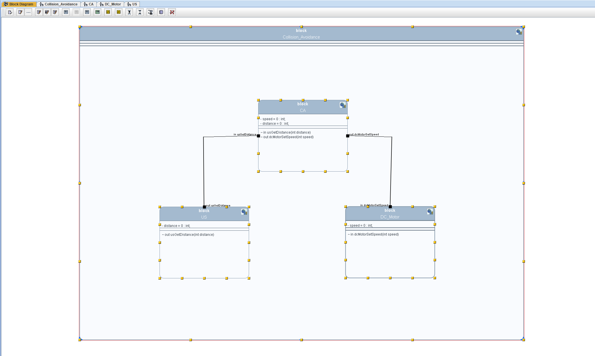
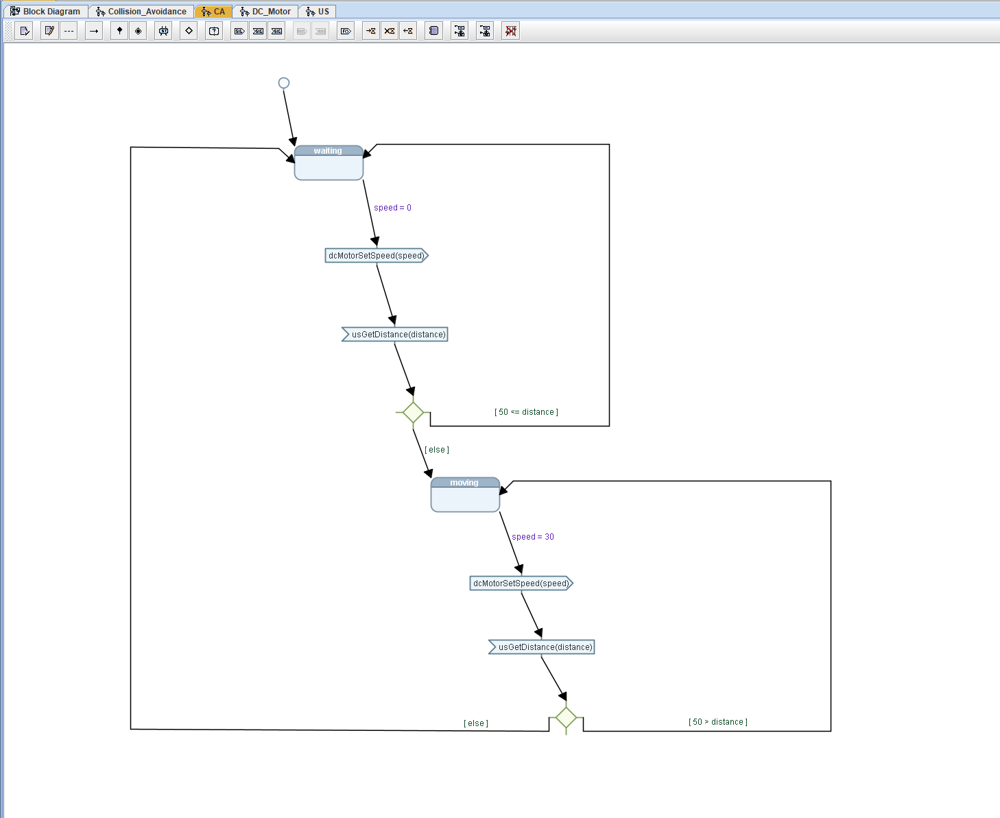
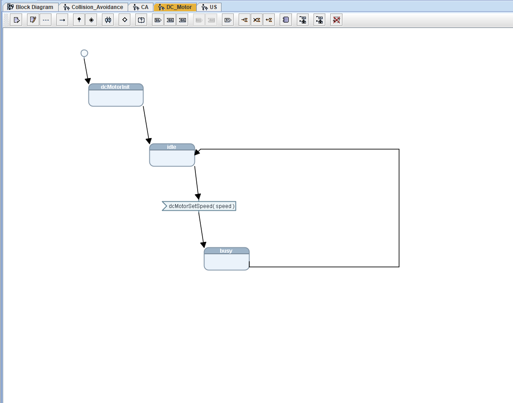
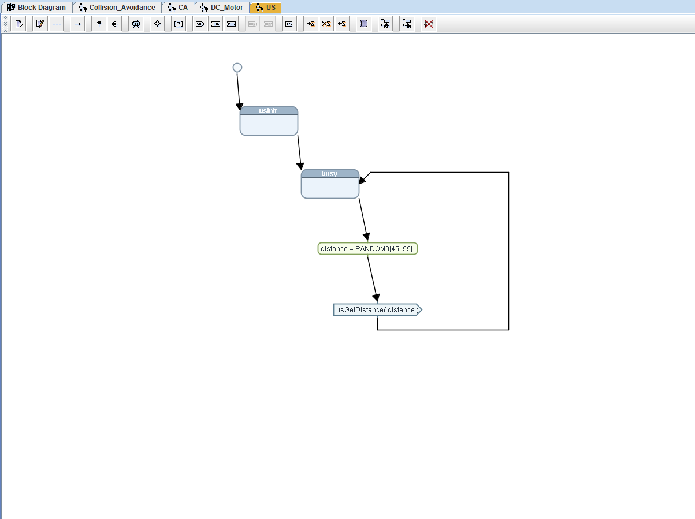
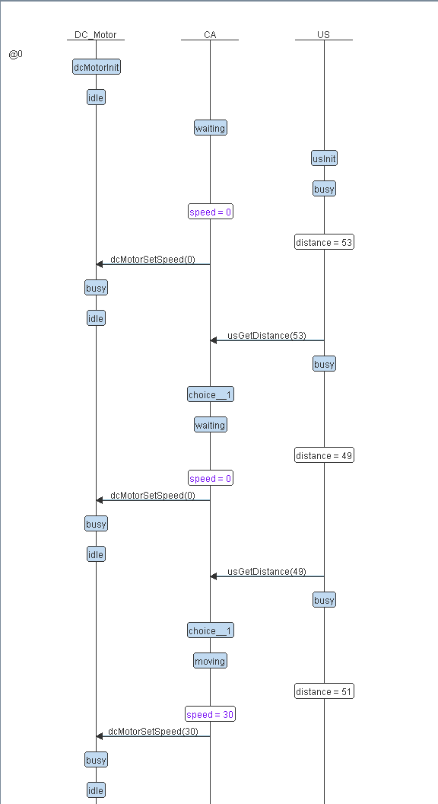
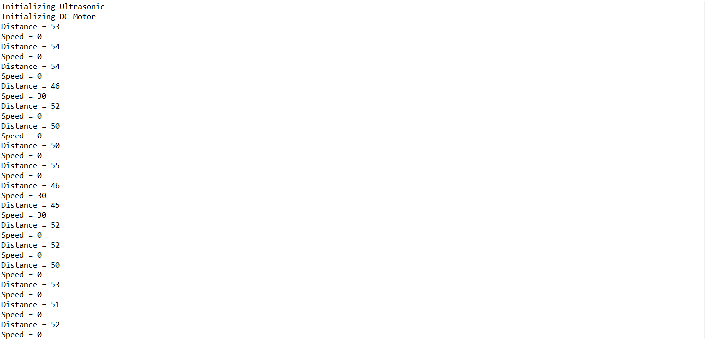

# Collision Avoidance – TTool

A simple **Collision Avoidance system** modeled using **TTool / AVATAR** and implemented in C.

## 🎥 Demo

## 🏗️ System Architecture

The system consists of:

- **CA** – Collision Avoidance
- **US** – Ultrasonic Sensor
- **DC_Motor** – Motor control

## 🔄 State Machines

### Collision Avoidance

### DC Motor

### Ultrasonic

## 📊 Dynamic Sequence

## 💻 C Implementation

The corresponding C implementation is available in:

[Code_Implementation/](./Code_Implementation/)

