# Adel Shata

# Student Management System

A console-based Student Management System implemented in C using structures, pointers, file handling, string manipulation, and a circular queue.

---

## Project Overview

This project is a **Student Management System** implemented in C. It manages student records with support for adding students manually or loading them from a text file. The system provides functionality for searching (by roll number, first name, or course), updating, deleting, and displaying student information. Each student can be associated with multiple courses from a predefined list.

**Key C Concepts Demonstrated:**
- Structures and nested structures
- Pointers and pointer arithmetic
- Arrays and circular buffer/queue implementation
- Modular programming with header/source separation
- File I/O and string tokenization (`strtok`)
- Input validation (GPA range, course IDs, duplicate detection)
- Enumerations for type-safe constants
- Static helper functions for encapsulation

---

## Features

| Feature | Description |
|---------|-------------|
| Add student manually | Interactive prompts for roll, name, GPA, and courses |
| Add students from file | Bulk load from `students.txt` with error handling |
| Search by roll number | Exact match lookup with full details display |
| Search by first name | Case-insensitive search, shows all matches |
| Search by course | Lists all students enrolled in a given course |
| Update student information | Modify roll, first name, last name, GPA, or courses |
| Add/remove student courses | Manage course enrollment per student |
| Delete student | Removes record and compacts circular queue |
| Display database statistics | Shows registered count and remaining capacity |
| Duplicate roll detection | Prevents duplicate roll numbers on add/update |
| Duplicate course detection | Prevents duplicate courses per student |
| Input validation | Validates GPA (0–4), course IDs, string lengths |
| Maximum capacity handling | Graceful handling when database is full (50 students) |

---

## Data Structures / Architecture

### Core Structures

**`student_infos_t`** — Stores a single student's record:
```c
typedef struct {
    char        fName[50];
    char        lName[50];
    course_id_t cId[MAX_COURSES_PER_STUDENT];
    float       gpa;
    int         courseCount;
    int         roll;
} student_infos_t;
```

**`student_queue_t`** — Circular queue managing the student database:
```c
typedef struct {
    unsigned int     count;
    student_infos_t *top;   // Points to most recently added student
    student_infos_t *tail;  // Points to oldest student
    student_infos_t *base;  // Start of the underlying array
} student_queue_t;
```

**`course_id_t`** — Enumeration of 19 available courses (MATH1–5, OPERATING_SYSTEMS, CONTROL1–3, ELECTRONICS1–2, CIRCUIT1–3, DEUTSCH, ENGLISH).

### Circular Storage Mechanism

The database uses a fixed-size array (`studentList[50]`) managed as a circular queue:

```
base (studentList[0])
  ↓
[Student] → [Student] → [Student] → ... → [Student]
    ↑                                      ↓
    └───────────── circular ───────────────┘
tail (oldest)                          top (newest)
```

- **`base`**: Fixed pointer to `studentList[0]`
- **`tail`**: Points to the oldest valid student (first inserted)
- **`top`**: Points to the most recently added student
- **`count`**: Number of valid students in the queue
- **`repositionPointer()`**: Handles wrap-around when incrementing/decrementing pointers

When the queue is not full, new students are added at `top + 1` (with wrap). On deletion, elements are shifted toward the gap to maintain contiguity, and `top`/`tail` are adjusted accordingly.

---

## Functions

### Primary Functions

| Function | Purpose |
|----------|---------|
| `studentAddManually()` | Interactive addition of a single student with validation |
| `studentAddFromFile()` | Parses `students.txt`, adds valid records, handles errors per line |
| `studentFindNum()` | Prints total registered students and remaining slots |
| `studentFindByRoll()` | Searches by roll number, displays full student info |
| `studentFindByFName()` | Case-insensitive search by first name, lists all matches |
| `studentFindCourses()` | Lists all students enrolled in a given course ID |
| `studentDelete()` | Removes student by roll, compacts circular queue |
| `studentUpdate()` | Menu-driven update of roll, names, GPA, or courses (add/remove) |

### Helper Functions

| Function | Purpose |
|----------|---------|
| `repositionPointer(ptr, dir)` | Increments/decrements pointer with circular wrap-around |
| `storageStatus()` | Returns `EMPTY`, `FULL`, or `NEITHER_FULL_NOR_EMPTY` |
| `rollStatus(roll, out)` | Checks if roll exists; returns `ROLL_VALID` or `ROLL_REGISTERED` |
| `courseStatus(id, student)` | Validates course ID and checks for duplicates |
| `studentGetString(buf, len)` | Reads a line from stdin, strips newline |
| `studentAddGpa(student)` | Prompts for GPA with 0–4 validation loop |
| `studentAddCourses(student)` | Interactive course selection menu with duplicate checking |
| `studentFillInfos(roll, student)` | Collects all fields for a new student record |
| `studentDisplayCourses(id)` | Prints human-readable course name for a course ID |
| `studentDisplayInfos(student)` | Prints formatted student record with courses |

---

## File Input

The system reads `students.txt` with one student per line. Fields are space-separated.

**Format:**
```
<roll> <firstName> <lastName> <gpa> <courseId1> <courseId2> ...
```

**Example (from actual `students.txt`):**
```
1001 Adel Shata 4 1 6 10 13
1002 Ahmed Ali 2.50 2 7 11 15
1003 Mohamed Hassan 4.00 3 8 12 16
```

**Field Details:**
- **Roll**: Integer, must be unique
- **First Name**: Single token (no spaces)
- **Last Name**: Single token (no spaces)
- **GPA**: Float, must be in range `[0.0, 4.0]`
- **Course IDs**: Integers 1–19 corresponding to `course_id_t` enum values

**Error Handling (per actual implementation):**
- Missing first/last name → Prompts for manual entry
- Invalid/missing GPA → Prompts for manual entry with validation
- Invalid or duplicate course ID → Skipped with warning
- No valid courses → Prompts for manual course entry
- Duplicate roll in file → Skips that line with warning
- Database full → Stops processing, reports failure

---

## Program Demonstration

The following screenshots demonstrate the key functionalities of the system.

### Main Menu

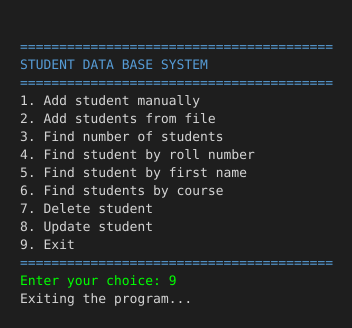

The program starts with a numbered menu offering all operations.

---

### Add Student Manually

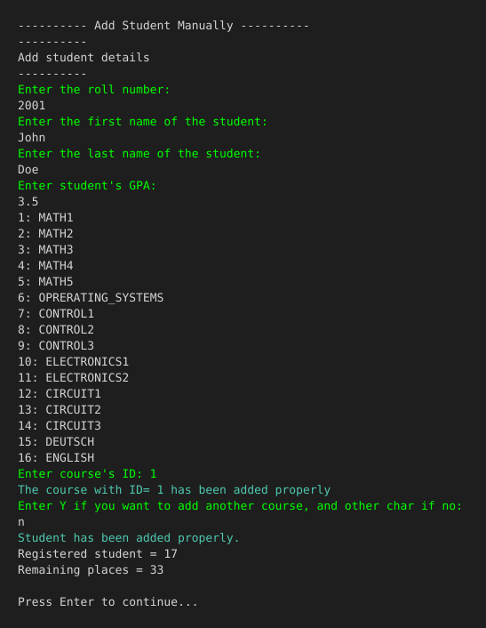

Interactive prompts guide the user through entering roll, names, GPA (validated 0–4), and courses (selected by ID from a displayed list).

---

### Load Students from File

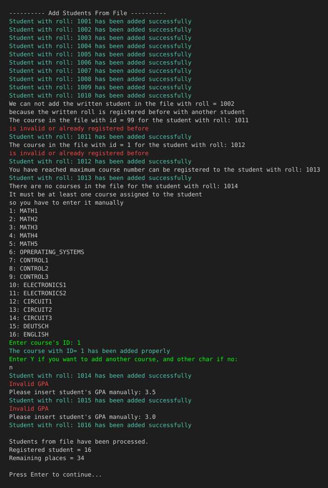

Loads 10 valid students from `students.txt`. Demonstrates handling of duplicate roll (1002), invalid course (99), duplicate course, too many courses, missing courses, and invalid GPA values — all reported inline without stopping the import.

---

### Search by Roll Number

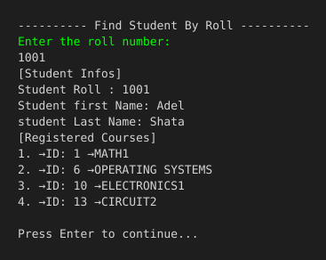

Exact match lookup displays the student's full record including all enrolled courses with readable names.

---

### Search by First Name

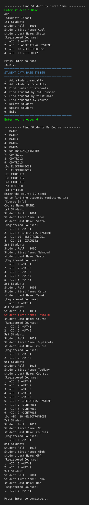

Case-insensitive search finds all students matching the given first name.

---

### Search by Course

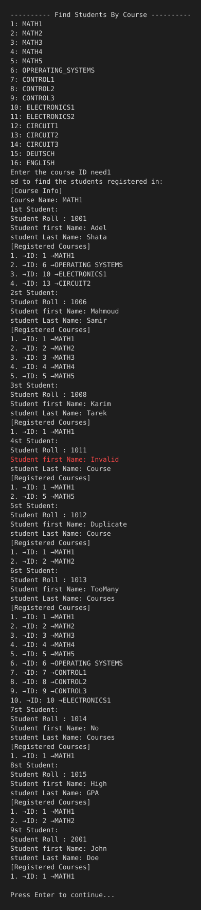

Lists all students enrolled in the selected course (e.g., MATH1 = ID 1).

---

### Update Student

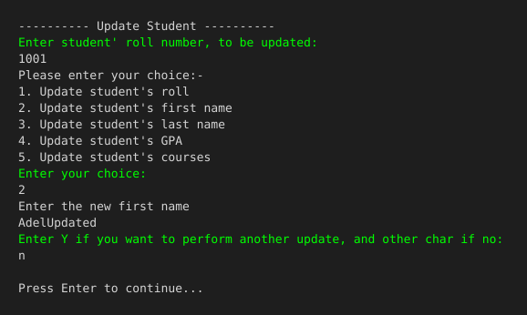

Menu-driven update allows changing roll (with duplicate check), first name, last name, GPA, or courses (add/remove). Multiple updates can be chained in one session.

---

### Delete Student

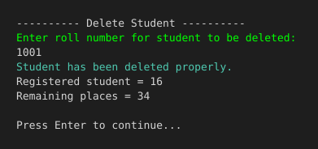

Removes a student by roll number. The circular queue is compacted and statistics are updated.

---

### Input Validation Examples

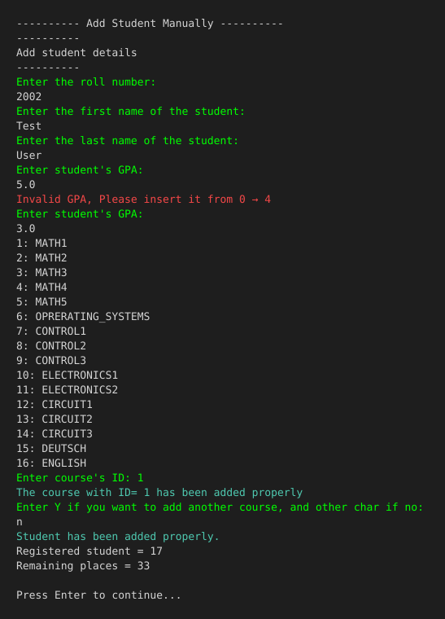

Shows validation for GPA (must be 0–4), course IDs (must be 1–19), and duplicate roll detection.

---

### Duplicate Roll Detection

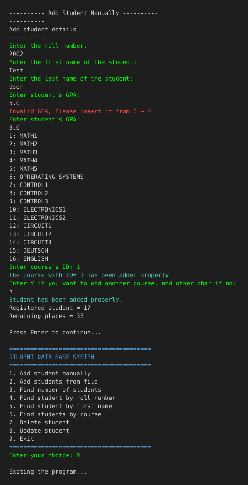

Attempting to add a student with an already-registered roll number is rejected with a clear error message.

---

### Database Statistics

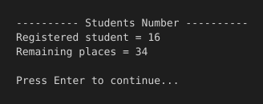

Shows current registered student count and remaining capacity at any time.

